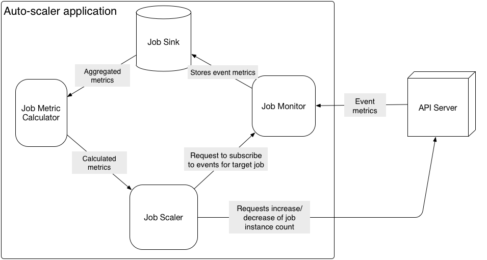

## Apcera Job Auto-scaler Application

The Apcera Job Auto-scaler application demonstrates how to monitor, analyze and scale the number of running instances of another job based on that job's CPU usage. The auto-scaler uses the [Events System API](http://docs.apcera.com/api/events-system-api/) to subscribe to a stream of resource usage metrics for a target job you specify by FQN. The auto-scaler app collects and stores usage CPU metrics over a time window you specify and computes the average CPU usage across all job instances.
If the computed CPU usage rises above (or falls below) a percentage of the total available CPU that you specify, the auto-scaler uses the [Apcera REST API](https://docs.apcera.com/api/apcera-api-endpoints/#put-v1jobsuuid) to increase or decrease the number of job instances, as necessary.

The auto-scaler application has been tested to work with Apcera Platform version 2.4.0 and above.

See the [tutorial](tutorial.md) that demonstrates how to use and configure the auto-scaler application.

## Requirements

To use the auto-scaler application the following conditions must be met:

* Apcera cluster must be configured to use HTTPS. The auto-scaler authenticates with the cluster using [app tokens](http://docs.apcera.com/jobs/app-token/#requirements), a feature that depends on HTTPS.
* [Policy](#requiredpolicy) must exist that issues an app token to the auto-scaler, and gives it permission to read/update properties of the target application.
* [CPU reservation](#cpureserve) must be set on the target application to monitor.

### Required policy

For the auto-scaler to function you must add policy to your cluster that issues an application token to the auto-scaler application, and that permits the auto-scaler to read and update properties on the target job. To do this you must have permissions to add/edit policy on your cluster (see [Policy authoring permissions](http://docs.apcera.com/policy/permissions/#policy-authoring-permissions)).

For example, suppose you've deployed the auto-scaler to `job::/sandbox/admin::apcera-job-scaler` and it is [configured](#options) to monitor the application at `job::/prod::my-app`. In this case, the following policy would be required:

    // Permit token to be issued to job-scaler app
    on job::/sandbox/admin::apcera-job-scaler {
        {permit issue}
    }

    // Permit job-scaler app to read and update properties of the target app
    on job::/prod::my-app {
        if (auth_server@apcera.me->name == "job::/sandbox/admin::apcera-job-scaler") {
            permit read, update
        }
    }

### Setting CPU reservation on target job {#cpureserve}

For the auto-scaler calculate CPU usage, you must assign a CPU reservation to the app you want to monitor. (By default, applications are provided with unlimited CPU time.) For example, the following command creates a new application and reserves 200 milliseconds of CPU time per second of physical time for the target app:

    apc app create my-app --cpus 200

Or to update an existing job's CPU reservation:

    apc app update my-app --cpus 200

## Configuring and deploying the Auto-scaler {#options}

The auto-scaler app's behavior is configured by the following environment variables that it reads from its enviroinment.

| Environment variable name | Description                                                                                                           | Default value |
| ------------------------- | --------------------------------------------------------------------------------------------------------------------- | ------------- |
| `API_ENDPOINT`            | **Required**. Cluster's API Server endpoint URL (api.example-cluster.com, for example).                                   | None.         |
| `TARGET_JOB`              | **Required**. The FQN of the job to monitor and scale.                                                                    | None.         |
| `SCALING_FREQ`            | Time in seconds after which the auto-scaler app will decide whether scale the target job or not.       | 60    |
| `CPU_ROOF`                | Percentage of CPU utilization of the target job above which the job instance should be incremented. | 80%           |
| `CPU_FLOOR`               | Percentage of CPU utilization of the target job below which the job instance count should be decremented. | 20%           |
| `INSTANCE_COUNTER`        | Number of instances to create or delete when the auto-scaling behavior is triggered.                          | 1             |
| `MAX_INSTANCES`           | Maximum number of instances the target job should be scaled up to.                                                    | 99            |
| `MIN_INSTANCES`           | Minimum number of instances the target job should be scaled down to.                                                  | 1             |

The easy way to deploy and configure the auto-scaler is with the provided application manifest ([continuum.conf](continuum.conf)). Locate the `env` block in the manifest and change the values of the environment variables, as necessary:

    # App Environment Variables;
    env {
       "API_ENDPOINT": "api.<cluster.domain>",
       "TARGET_JOB": "job::/<your>/<namespace>::<your-app>",
       "SCALING_FREQ": "30",
       "CPU_ROOF": "80",
       "CPU_FLOOR": "20",
       "MAX_INSTANCES": "20",
       "MIN_INSTANCES": "1",
       "INSTANCE_COUNTER": "1",
    }

Make the following changes to the environment variables:

* Replace `<cluster.domain>` in the `API_ENDPOINT` variable to your cluster's API Server URI (`api.example.com`, for example).
* Set the `TARGET_JOB` to the FQN of the example-go app you deployed previously (`job::/sandbox/admin::example-go`, for example). You **must** set a CPU reservation on the target job for the auto-scaler to compute CPU usage. See [Setting CPU reservation](#cpureserve).
* Leave the other [configuration options](#options) at their default values, or set them to the desired values.

Run the `apc app create` command to deploy the auto-scalcer using the modified app manifest run

    cd sample-apps/apcera-job-scaler
    apc app create

You also need to add policy to permit the auto-scaler to make authenticated API calls to read and update properties on `TARGET_JOB`. See [Required policy]().

## Auto-scaler application design and behavior

The auto-scaler application is composed of the following components: Job Monitor, Job Sink, Job Metric Calculator, and Job Scaler itself.

* Job Monitor -- Subscribes to events for the target job using the [Apcera Events System API](https://docs.apcera.com/api/events-system-api/). It saves metric event records to the Job Sink.
* Job Sink -- Stores and aggregates the metric data obtained for the target job for the latest time window specified by the `$SCALING_FREQ` parameter.
* Job Metric Calculator -- Acts as decorator to the information begin stored in Job Sink. It provides the algorithms for calculating resource utilization summaries for requested jobs. Currently, it only calculates CPU usage.
* Job Scaler -- Provides the primary application logic for scaling the target job's instance count up or down.

When the auto-scaler application starts up it reads its [configuration](#options) from the environment. It then subscribes to resource usage events for the job specified by the `$TARGET_JOB` environment variable. The Event Server publishes an [instance resource usage event](http://docs.apcera.com/api/event-object-reference/#instance-metric-events) every 10 seconds for each instance of the target job. Each usage event contains the instance's current CPU usage and its total CPU reservation.

At the end of the time period specified by the `$SCALING_FREQ` environment variable, the auto-scaler computes the target job's average (arithmetic mean) CPU usage across all instances. CPU usage is calculated as the arithmetic mean CPU usage for each individual instance of `$TARGET_JOB`, and then again the arithmetic mean of CPU utilization across all the instances of `$TARGET_JOB`. Based on this calculation it does one of the following:

- If the computed CPU usage is greater than `$CPU_ROOF`, and the total number of instances is not greater than `$MAX_INSTANCES`, it increases the number of instances of `$TARGET_JOB` by `$INSTANCE_COUNTER`.
- If the computed CPU usage is less than `$CPU_FLOOR`, and the total number of instances is not less than `$MIN_INSTANCES`, it decreases the number of instances of `$TARGET_JOB` by `$INSTANCE_COUNTER`.
- Otherwise, no action is taken on the target job.

Logs from the auto-scaler app are forwarded to **stderr**.

## Troubleshooting

Below are some common issues you may encounter when deploying or using the auto-scaler app.

* **"Failed joining the Event Server realm %!!(MISSING)(EXTRA string=com.apcera.api"** -- This error can indicate that your cluster is missing required policy to issue an API token to the auto-scaler app. See [Required Policy](#requiredpolicy). Also make sure you your cluster is configured to use HTTPS, which is required for app tokens to function.
* **"Job metrics not reported yet."** -- This message appears if you didn't add policy to allow the auto-scaler app to read and update the target job's properties. See [Required Policy](#requiredpolicy). Also make sure the target app is running.

