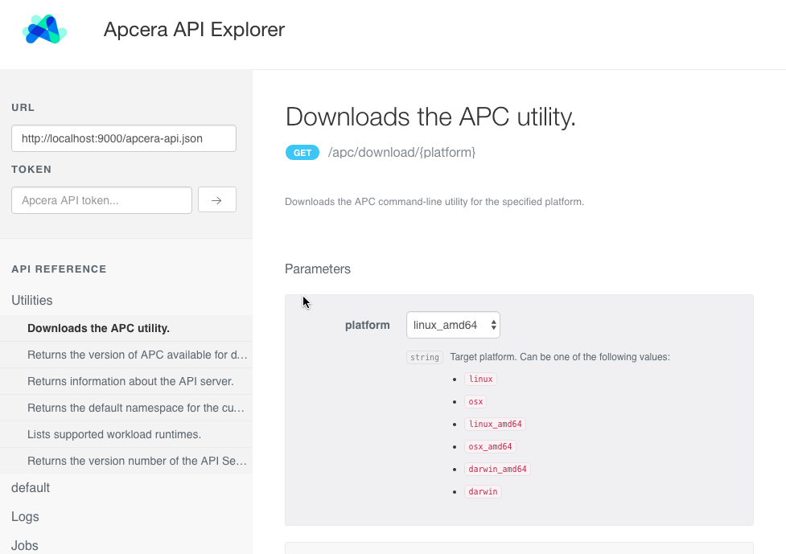
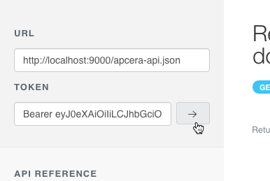
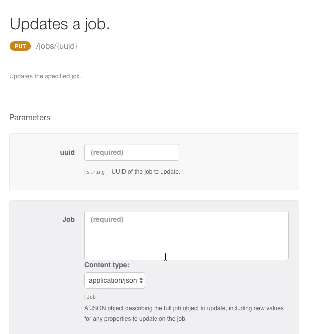
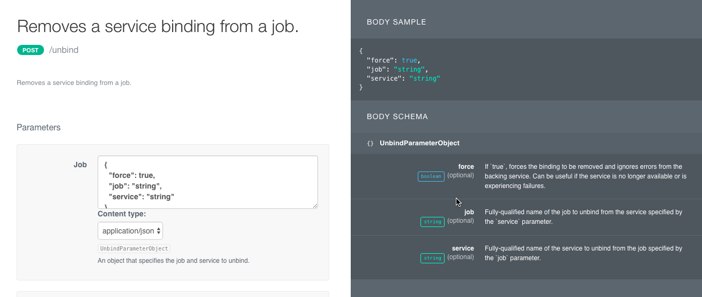

# Apcera API Explorer

The Apcera API Explorer is a web application that lets you experiment with and learn about the [Apcera REST API](docs.apcera.com/api/apcera-api-endpoints/). This is the same API used by APC and the Web Console to interact with an Apcera cluster. 

## Starting the API Explorer

The API Explorer takes as input a JSON file (a Swagger specification) that describes each REST API endpoint. To use API Explorer with your cluster, you need to edit this JSON file to point to the API host on your cluster (`api.your-cluster.example.com`, for example). 

Due to cross-domain restrictions in web browsers, you must run API Explorer on a local web server at `localhost:9000`. Your Apcera cluster will not accept requests if the app is running on another domain. 

1. Open **apcera-api.json** in a text editor.
2. Locate the `host` field in the JSON file and modify it to point to your cluster API server host. For instance, if your cluster is deployed to `example.com` change `host` to the following:

        "host": "api.example.com",

4. Save your changes to `apcera-api.json`.
2. Start a local web server on `localhost:9000`. For instance, if you have Python installed you can use its built-in web server:

        python -m SimpleHTTPServer 9000      
        
8. Open [http://localhost:9000](http://localhost:9000) to view the API Explorer.

   
## Providing your API token {#token}

To make API calls you need to provide the API Explorer with your API token. An easy to obtain your API token is from the `$HOME/.apc` file. This file is created by APC and contains the API tokens for each cluster you have targeted.
   
**To provide your API token**:

1. Open `~/.apc` (or `$HOME/.apc`) in a text editor.
2. Locate the `tokens` field for your cluster, e.g.

        {
          ...
          "tokens": {
            "https://mycluster.apcera-platform.io:443": "Bearer eyJ0eXAiOiIiLCJhbGci..."
          },
          ...
        }

3. Copy the value of the API token for your cluster, with or without the "Bearer " preamble.  
4. In Apcera API Explorer, paste the token into the **API Token** field and click the arrow. 

    
   
You're now ready to make [API calls](#apicalls).

## Using the API Explorer  {#apicalls}

To make an API call, locate the API you want to invoke in the API Reference list and click the **Try** button. 

The results of the API call appear in a pop-up:

The **Parameters** section lists the parameters supported by each endpoint, with required parameters labeled as such.

To the right of each API endpoint are collapsible sections that display that API's response schema and a sample JSON response. For `PUT`/`POST` methods that take a JSON object in the request body, the request object schema and a sample JSON request object are also displayed.

## Troubleshooting

Below are common errors you may encounter using API Explorer.

* **"Header must have a preamble and a token separated by a space"** -- If a response body contains this message it means that the request did not contain the API token. Try setting your API token again (see [Providing your API token](#token)).

* **"illegal base64 data..."** -- If the response body contains this type of message it means the API token you provided contained an expected character. This can occur sometimes when copying the token from an application that uses a non-standard text encoding. Try copying the token into a plain text document first and then copying the value from that location. 
