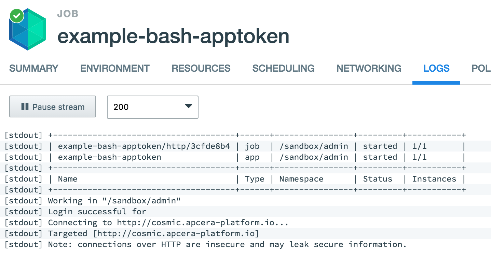

# Making APC calls from a Bash script using App Tokens

This sample shows how to create a simple [Bash application](http://docs.apcera.com/packages/staging/#bash) that downloads and installs APC from your cluster, logs in using an [app token](http://docs.apcera.com/jobs/app-token/), and calls `apc job list`. App tokens are issued to a job (by its FQN) rather than to an authenticated user.

The `bash_setup.sh` script (which is executed by the Bash staging pipeline) downloads the APC binary for Linux from the target cluster. The `bash_start.sh` script then uses APC to target and log in to the cluster, and make an APC call to list jobs.

## Deploy the application

To deploy the sample application you first need to update the bash_setup.sh script to point to your cluster. An environment variable is provided to the application that specifies the target cluster. You also need to add policy to that issues a token to the application, sets the job's default namespace, and assigns necessary permissions for it to be able to manage jobs in the user's sandbox namespace.

**To deploy the application**:

1. Open `bash_setup.sh` in an editor and change the `target` variable to point to your cluster:

        # Set the target cluster (e.g. your-cluster.apcera-platform.io):
        export target=your-cluster.example.com

    Save your changes to `bash_setup.sh`.

3. Open a terminal window and move to the `example-bash-apptoken/` directory.
4. Create the Bash application  and set the `target` environment variable to point to your cluster (e.g. `--env-set target=your-cluster.apcera-platform.io`):

        apc app create example-bash-apptoken \
        --env-set target=your-cluster.example.com --disable-routes --batch

    During the staging process, bash_setup.sh is run, which downloads and extracts APC. The `--disable-routes` flag is used because the app doesn't listen on any ports.

3. Bind the application to the HTTP service (required to use app tokens):

        apc service bind /apcera::http --job example-bash-apptoken

4. Using the APC or the [Web Console](https://docs.apcera.com/quickstart/console_tasks/#policy-editor) add the following policy to your cluster. Replace each instance of `<USER>` with your username:

        // Permit cluster to issue a token to the job:
        job::/sandbox/<USER>::example-bash-apptoken {
            { permit issue }
        }

        // Provide job admin permissions over the /sandbox/<USER> namespace:
        job::/sandbox/<USER> {
            if (auth_server@apcera.me->name == "job::/sandbox/<USER>::example-bash-apptoken") {
                role admin
            }
        }

5. Start the application using APC or the [Web Console](https://docs.apcera.com/quickstart/console_tasks/#starting-and-stopping-jobs):

        apc app start example-bash-apptoken

6. View the application logs using APC or the [Web Console](https://docs.apcera.com/quickstart/console_tasks/#tailing-job-logs):

        apc app logs example-bash-apptoken
        [stdout][1b9ca501] Note: connections over HTTP are insecure and may leak secure information.
        [stdout][1b9ca501] Targeted [http://cosmic.apcera-platform.io]
        [stdout][1b9ca501] Connecting to http://cosmic.apcera-platform.io...
        [stdout][1b9ca501] Login successful for
        [stdout][1b9ca501] Working in "/sandbox/admin"
        [stdout][1b9ca501] +-------------------------------------+------+----------------+---------+-----------+
        [stdout][1b9ca501] | Name                                | Type | Namespace      | Status  | Instances |
        [stdout][1b9ca501] +-------------------------------------+------+----------------+---------+-----------+
        [stdout][1b9ca501] | example-bash-apptoken               | app  | /sandbox/admin | started | 1/1       |
        [stdout][1b9ca501] | example-bash-apptoken/http/3cfde8b4 | job  | /sandbox/admin | started | 1/1       |
        [stdout][1b9ca501] +-------------------------------------+------+----------------+---------+-----------+

    
